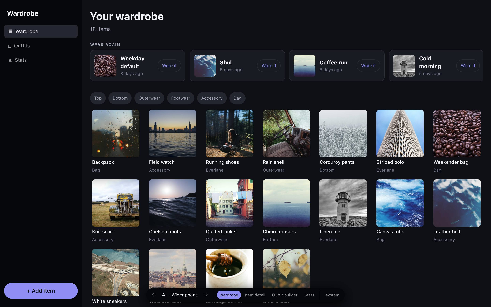
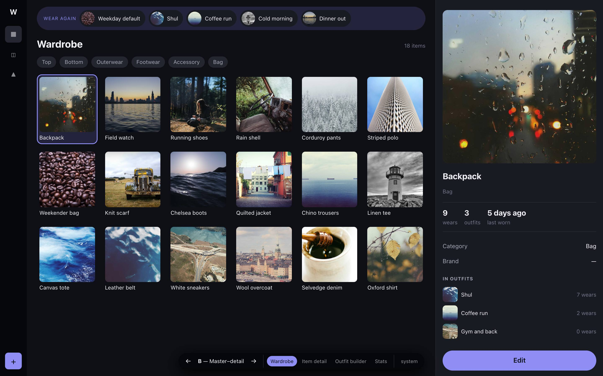
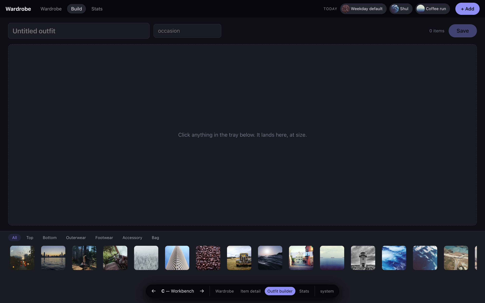
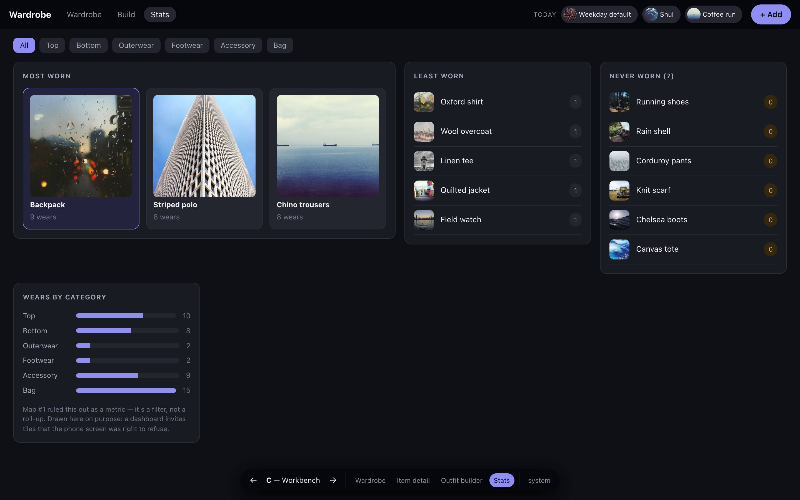

# PROTOTYPE — responsive desktop & phone layouts

Throwaway. Answers [issue #96](https://github.com/ShmuelAmir/wardrobe-tracker/issues/96)
on map [#87](https://github.com/ShmuelAmir/wardrobe-tracker/issues/87), then gets
deleted. Nothing here is production code. The only thing meant to survive is the
decision it settles.

**Three variants of the responsive layout, switchable via `?variant=`, each
rendering all four load-bearing screens via `?screen=`.**

## Run it

```sh
npm --prefix prototype/layouts install     # once
npm --prefix prototype/layouts run dev
```

Then open <http://localhost:5174>. It reads the same seeded Convex deployment
the #95 slice used — if the wardrobe is empty, run `npx convex run seed:wardrobe`
from the repo root first.

The floating bar at the bottom is the switcher, not part of any design: `←` / `→`
(or the arrow keys) cycle the variant, the four buttons pick the screen, and the
last button cycles system → light → dark. Resize past **900px** to cross between
the desktop and phone layouts — both are meant to be judged.

## The three theses

The variants are not three versions of the same design. Each is a different
answer to *what desktop is for*, and each one's answers to #96's four questions
fall out of that thesis rather than being chosen separately.

### A — Wider phone

There is one design. Desktop is the same screens in a wider viewport, and all it
buys is density. The only structural change across the breakpoint is the bottom
tab bar rotating into a left rail.

- **Nav:** left rail ⇄ bottom tabs.
- **Wear-again rail:** survives on desktop, unchanged.
- **Add-item wizard:** stays full-screen routes, exactly as on phone.
- **Item detail:** a full-width route. Tapping an item *leaves* the grid.
- **Cost:** cheapest to build, cheapest to keep — one layout, one component set.
- **Judge it on:** whether the desktop screens read as *empty* rather than wide.
  The 240px rail holds three links and a button, and the detail and stats screens
  are capped at a 720px column with a lot of nothing beside them.



### B — Master–detail

On desktop the expensive thing is losing your place. A phone pushes a detail
screen because it has no room; a desktop doesn't. So the list pane stays mounted
and the right pane changes — the *same* two-pane shape on every screen.

- **Nav:** a 64px icon rail (the list pane needs the width) ⇄ bottom tabs.
- **Wear-again rail:** loses its home — there's no "Outfits tab you land on" — so
  it becomes a strip pinned above the list, present on every screen.
- **Add-item wizard:** a **modal** over the grid. Pushing a route would defeat
  the variant.
- **Item detail:** never gets full width, so the hero is small. That's the trade.
- **Builder:** the selection is permanently visible in the right pane while you
  pick — the strongest argument for this shape.
- **Stats:** selecting a leaderboard row inspects it without leaving the
  leaderboard, which the phone screen can't do.
- **Below 900px** the detail pane stops being a pane and stacks under the list —
  i.e. it degrades into A.



### C — Workbench

The app's point is assembling outfits, and desktop is the first surface with room
to do it properly. The builder stops being one screen among four and becomes the
shape everything borrows: a stage on top, a persistent wardrobe tray along the
bottom.

- **Nav:** a top bar — the tray owns the bottom edge, and a left rail would fight
  the full-bleed stage.
- **Wear-again rail:** promoted to a permanent "Today" strip in the top bar.
  Logging is the only *daily* act (map #1, #13), so it gets chrome.
- **Add-item wizard:** an inline tray step. Not a route, not a modal.
- **Item detail:** an overlay over the gallery, so the tray survives.
- **Stats:** a dashboard — most-worn, least-worn and never-worn visible at once
  instead of sub-tabs, plus hover affordances on the gallery.
- **Judge it on:** whether the tray earns the vertical space it permanently
  costs, and whether the dashboard is over-built for a 40-item wardrobe.




## What's real and what isn't

- **Items are real.** The same `api.items.list` read the #95 slice used, against
  the seeded deployment — so grid density and image weights on screen are honest.
  (The seed images are stock photos, not garments; that's #95's seed, not a
  layout claim.)
- **Outfits and wear events are synthesized in the browser** (`src/data.ts`),
  derived deterministically from the real items. The deployment has no outfit
  seed and **#97 hasn't decided their shape**, so writing rows server-side would
  pre-empt that ticket. Nothing here mutates.
- **No routing library** — two search params (#99 owns routing).
- **No auth, no uploads, no error states, no tests.**
- **The add-item wizard is described, not built.** Each variant states where it
  goes; none of the three actually renders the steps. If the wizard's modality is
  the deciding factor, that's a second pass.

## Things the build surfaced

1. **The token system held again, at four times the surface area.** `styles.css`
   is ~1,300 lines across three unrelated layouts and contains **no colour
   literal** — every colour is a `--wt-*` role variable walked off the shipped
   `light`/`dark` maps by the generator copied from #95. Three structurally
   different designs needed **zero new roles**. That's a stronger result than the
   slice's single screen produced, and it's the second piece of evidence that
   ADR-0013 ports without amendment.

2. **The breakpoint is genuinely one media query per variant** — but only because
   each variant collapses to *the same* phone layout. B and C both degrade toward
   A below 900px (B's pane stacks, C's tray becomes a rail). That is the real
   finding hiding in "desktop is a first-class layout": **the phone design is
   shared, and only the desktop design forks.** Whatever wins, the phone build is
   one design, not three.

3. **A's desktop is visibly under-filled, and that's the honest cost of the
   cheapest option** — a 240px rail holding three links, a 720px detail column
   with empty space beside it. Not fatal, but it is what "wider phone" actually
   looks like at 1440px, and it should be judged from the screenshot rather than
   from the description.

4. **`CATEGORIES` is still stranded in the Drizzle schema.** All three variants
   declare their own local copy rather than import it, because #95's finding #3
   hasn't been actioned yet. Third time it's bitten — it belongs in a
   platform-free module before `src/db/` is deleted.
