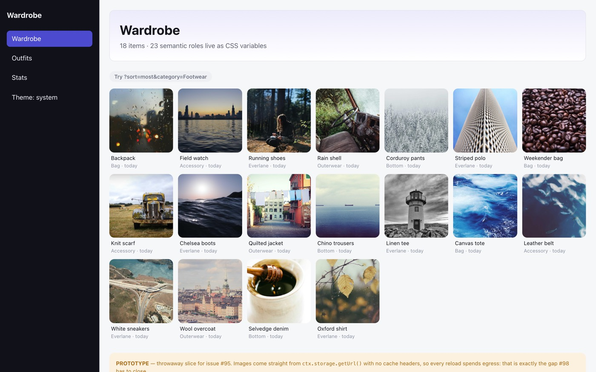
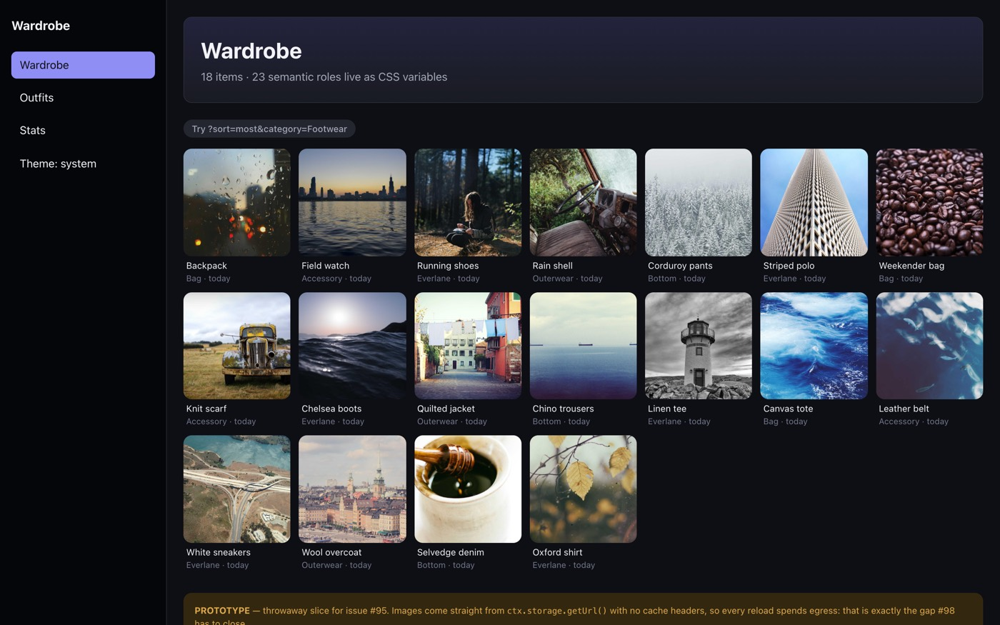

# PROTOTYPE — Vite + React + Convex vertical slice

Throwaway. Answers [issue #95](https://github.com/ShmuelAmir/wardrobe-tracker/issues/95)
on map [#87](https://github.com/ShmuelAmir/wardrobe-tracker/issues/87), then gets
deleted. Nothing here is production code and nothing here should be merged to
`main` — the only things meant to survive are the findings below.

## Run it

```sh
npx convex dev            # repo root, in one terminal — pushes convex/ and watches
npx convex run seed:wardrobe   # once, fills the deployment with 18 stand-in items
npm --prefix prototype/web-slice run dev
```

Then open <http://localhost:5173>. The **Theme** button in the rail cycles
system → light → dark. Resize past 900px to cross between the two layouts.

To wipe and reseed: `npx convex run seed:clear` (internal, so it needs
`--push` or the dashboard) then `seed:wardrobe` again.




## What it actually exercises

- **Convex → grid, end to end.** `convex/items.ts` reads the `items` table by
  index and resolves one `storage.getUrl()` per row; `convex/seed.ts` fetches
  real JPEGs over the network and hands the blobs to `ctx.storage.store()`.
- **The shipped domain modules, unmodified.** `App.tsx` imports
  `@/wardrobe-view` and `@/relative-time` through a Vite alias pointing at the
  repo's own `src/` — not copies. `parseWardrobeView` drives the screen off
  `URLSearchParams` instead of `useLocalSearchParams`.
- **The token system as CSS variables.** `src/theme/css-vars.ts` imports the
  real `light` and `dark` role maps and walks them mechanically into custom
  properties. `styles.css` contains no color literal at all.

## Findings

### 1. The stack holds. Vite + React, not `react-native-web`.

The slice went from empty directory to a themed grid reading live Convex data
in one session, with a 289 kB / 88 kB-gzipped bundle and a 94 ms dev-server
boot. Nothing pushed back toward `react-native-web`.

### 2. The token system gets *better*, not worse.

CSS custom properties are a native role→value indirection, so ADR-0013's one
rule survives intact and three things fall away:

- `useTheme()` disappears. Components write `var(--wt-text-primary)` and never
  subscribe to a context.
- `makeStyles(theme)` + `useMemo` — the design-system checklist's last item —
  becomes unnecessary rather than mandatory.
- The theme flip costs **zero re-renders**: light and dark are both emitted up
  front, and the scheme is one attribute on `<html>`.

All 23 roles port, `heroGradient` included (it becomes a `linear-gradient`).
Nothing was transcribed — the generator walks `Object.entries(light)`, so a role
added in review appears as a variable with no second edit, and a role present in
only one map stays a type error.

`__tests__/no-raw-hex.test.ts` has an obvious successor: the same sweep, run over
`.css` files, looking for `#`/`rgb(` outside the generated block.

### 3. `CATEGORIES` living in the Drizzle schema is a real problem.

`wardrobe-view.ts` looks platform-free, and its type imports are. But it
imports `CATEGORIES` *at runtime* from `src/db/schema.ts`, which is a Drizzle
table definition. Bundling that six-string array costs **23.1 kB** of
`drizzle-orm/sqlite-core`; the same measurement for `relative-time.ts` is
**237 bytes**.

So the port needs `CATEGORIES` and `SEASONS` moved into a platform-free module
of their own before `src/db/` is deleted. Cheap, but it is a prerequisite, not a
cleanup — and it's the only such snag the slice hit.

### 4. `getUrl()` *does* send a `Cache-Control` header. Measured, not documented.

Ticket #89 concluded Convex documents no default cache header. Empirically, on
1.43.0 / `dev:mellow-oyster-459` today, a `getUrl()` response carries:

```
cache-control: private, max-age=2592000
cf-cache-status: DYNAMIC
```

That is a 30-day **browser** cache — so repeat views on a warm browser cost zero
egress already. `private` is what keeps Cloudflare out of it (`DYNAMIC` = not
cached at the edge), so every *cold* client still pays full freight, and the
seeded 18-item grid weighs **1.92 MB** (~107 kB/image at 900px, in line with
#94's ~150 kB target).

This narrows #98's job from "make images cacheable at all" to "decide whether
`public` + an edge cache is worth a custom HTTP action". It does not eliminate
it, and the header is undocumented, so it could change.

### 5. Rewriting the screens is smaller than it looks.

Line counts on `main`:

| | lines |
|---|---|
| `src/app/` (17 screens) | 2,333 |
| `src/components/` (36 components) | 3,678 |
| `src/*.ts` (domain modules) | 1,765 |
| `src/theme/` | 374 |
| `src/db/` | 810 |

The 1,765 lines of domain logic port as-is (bar finding #3). `src/theme/`'s 374
lines collapse to a 58-line generator against the same role maps. `src/db/` is
deleted outright — Convex replaces it. That leaves **~6,000 lines of view code**
to rewrite.

The ratio is roughly **1:1, not a multiplier**, which is the useful part. This
slice's grid + hero + chips + chrome is 215 lines of CSS and 164 of TSX = 379,
against 456 lines for `item-grid.tsx` + `wardrobe-chips.tsx` +
`wardrobe-hero.tsx` + the tab layout and Wardrobe screen it stands in for. Take
that as *comparable*, not as a saving: the slice has no press handlers, no
zero-state hero, and no real navigation, so its true counterpart count is
somewhat higher than 379. What it does show is that `StyleSheet.create`,
`FlatList` plumbing and the `makeStyles(theme)` ceremony evaporating roughly
cancels out CSS being more verbose than style objects — so a ~6,000-line
rewrite is the right order of magnitude to plan against, and the schedule risk
is in the two hard screens (outfit builder, stats), not in bulk volume.

Five of the domain modules (`item-images`, `item-save`, `photo-capture`,
`web-download`, `web-import`) do import Expo and need rewriting — but four of
those five are the image/import path that #92, #94 and #98 already own.

### 6. Desktop and phone genuinely are two designs, and they cost one media query.

`grid-template-columns: repeat(auto-fill, minmax(150px, 1fr))` gives 7-up on a
1440px desktop and 3-up on a 390px phone, and the nav rail rotates from a
240px left column to a bottom bar at the same breakpoint. That is not evidence
the *whole* app is this cheap — the outfit builder and stats screens are the
hard ones — but the shell is not the problem #96 needs to solve.

## Known gaps (deliberate)

- No auth — `userId` is the literal string `"solo"` (#100 owns this).
- No routing library; the URL is read with `URLSearchParams` (#99 owns this).
- The `convex/schema.ts` here is a sketch to make the slice run, **not** the
  data model (#97 owns that).
- No image normalization on upload; there is no upload (#98, #94).
- No tests, no error states, no offline screen.
